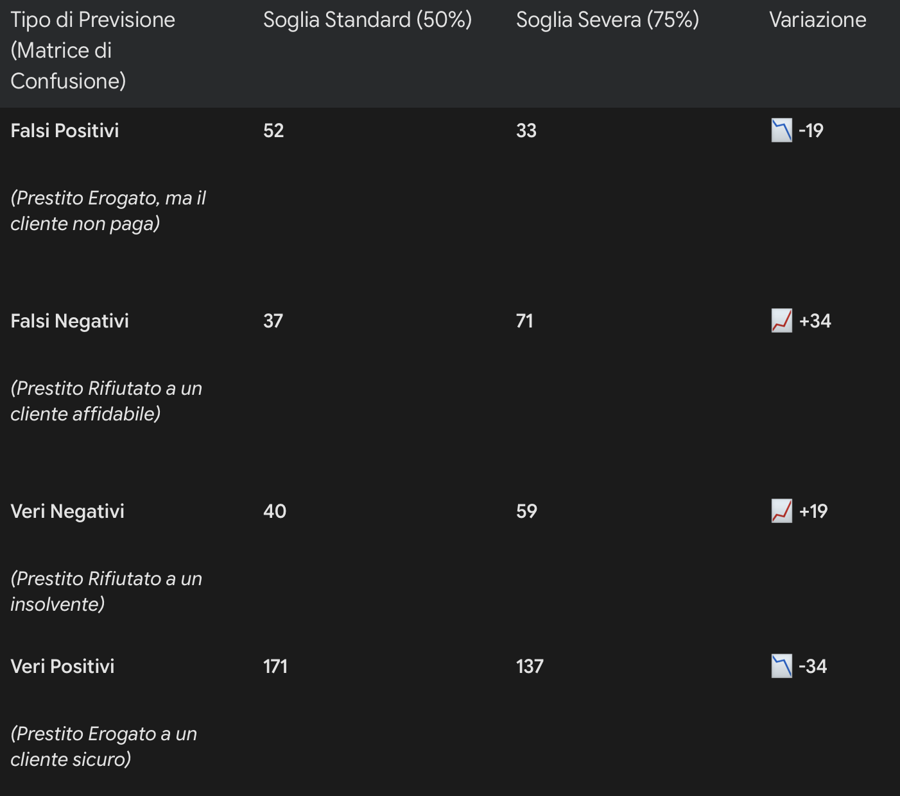
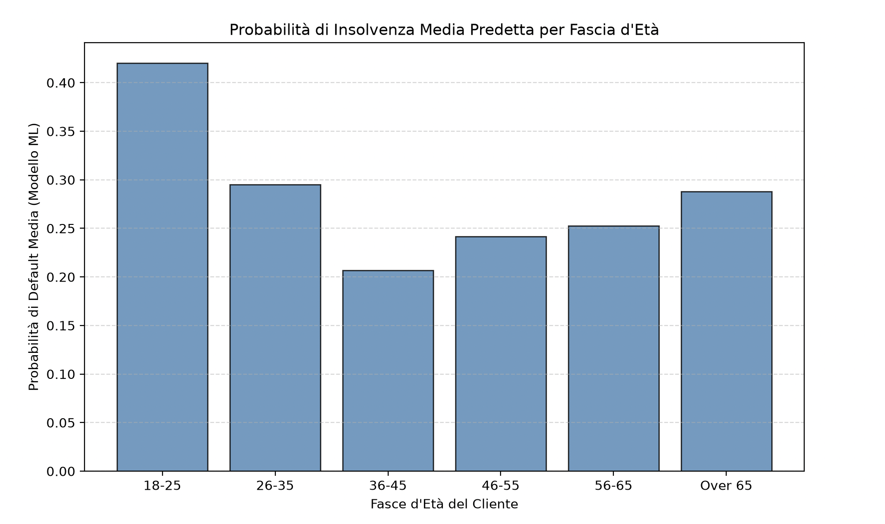

# Credit Risk Assessment & Default Prediction

## Obiettivo del Progetto
Questo progetto implementa un modello predittivo in Python strutturato per calcolare la probabilità di insolvenza su un prestito bancario. Utilizzando il dataset **German Credit Data**: le probabilità estratte dal modello servono a ottimizzare le decisioni di erogazione, minimizzando i costi operativi aziendali.

## Struttura del Dataset e Variabili Chiave
L'algoritmo valuta il profilo di rischio incrociando i dati demografici con gli attributi finanziari.

**Variabile Target ('credito'):**
*   **1 (Non Default):** Cliente a basso rischio che rispetta gli obblighi.
*   **0 (Default):** Cliente insolvente o con ritardi.

**Features Predittive:**
*   **Età e Anzianità Lavorativa:** Utilizzate per valutare la stabilità del reddito nel tempo.
*   **Conto Corrente:** Misura della liquidità immediata per gli impegni a breve termine.
*   **Patrimonio:** Misura della solidità a lungo termine che funge da garanzia (collaterale) per l'istituto.

## Stack Tecnologico
La pipeline di Data Science riflette le operazioni implementate nel file `main.py`:
*   **Pandas:** Utilizzato per il caricamento, la pulizia dei dati mancanti (`dropna`) e la segmentazione avanzata delle età in categorie strutturate tramite la funzione `pd.cut()`.
*   **Scikit-Learn:** Impiegato per l'addestramento del **Random Forest Classifier**. Attraverso la funzione `predict_proba()`, il modello non restituisce un'etichetta rigida, ma calcola l'esatta percentuale statistica di default per ogni cliente.
*   **Matplotlib:** Utilizzato per la generazione di grafici a barre aggregati che confrontano le fasce d'età con la probabilità media di insolvenza, eliminando il rumore statistico.

## Impatto di Business e Matrice di Confusione
Il risultato espresso in probabilità percentuali permette all'istituto di impostare soglie decisionali strategiche, bilanciando due tipologie di errore dal peso economico radicalmente diverso:

| Esito Modello | Il cliente paga (Realtà) | Il cliente NON paga (Realtà) |
| :--- | :--- | :--- |
| **Prestito Erogato** | Vero Positivo (Guadagno) | **Falso Positivo (Danno enorme)** |
| **Prestito Rifiutato** | **Falso Negativo (Mancato incasso)** | Vero Negativo (Perdita evitata) |

*   **Il Falso Positivo (Rischio Primario):** Si verifica quando il modello classifica erroneamente il cliente come sicuro e la banca eroga i fondi. Genera una perdita diretta del capitale prestato.
*   **Il Falso Negativo (Costo Opportunità):** Si verifica quando il modello è eccessivamente prudente e rifiuta un cliente affidabile. Causa alla banca un mancato guadagno sui potenziali interessi attivi.

L'architettura di questo modello è orientata a minimizzare i Falsi Positivi.

## Risultati

  

> **Matrice Iniziale (Soglia 50%):** Con la soglia decisionale di default, il modello risulta troppo "generoso". Approva prestiti con troppa facilità, generando ben 52 **Falsi Positivi** (clienti insolventi classificati come sicuri). Questo espone l'istituto a un rischio inaccettabile e a una massiccia perdita diretta del capitale erogato.

> **Matrice Ottimizzata (Soglia Severa 75%):** Sfruttando le probabilità continue calcolate dall'algoritmo, la soglia di approvazione è stata alzata al 75%. Il modello diventa così più prudente: i **Falsi Positivi crollano da 52 a 33**, tutelando attivamente la liquidità della banca. L'aumento dei Falsi Negativi (da 37 a 71) rappresenta un fisiologico costo opportunità (interessi persi) che la direzione accetta volentieri pur di "blindare" la cassa contro le insolvenze.

  

> Di conseguenza, per proteggere i bilanci della banca ed evitare i costosi Falsi Positivi, l'istituto utilizzerà le percentuali del modello per decidere di non erogare credito "alla cieca" su quelle fasce, richiedendo ulteriori solide garanzie per diminuire il rischio ed eventualmente procedere all'erogazione del prestito.
